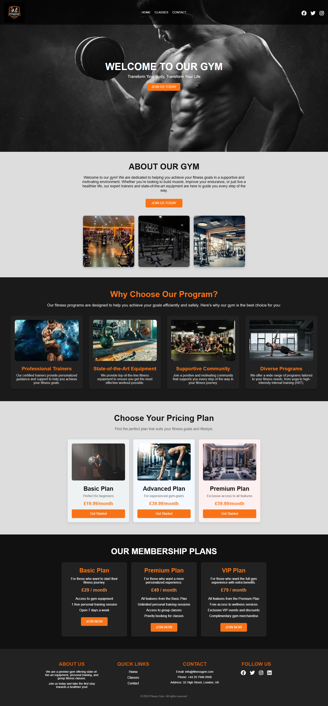
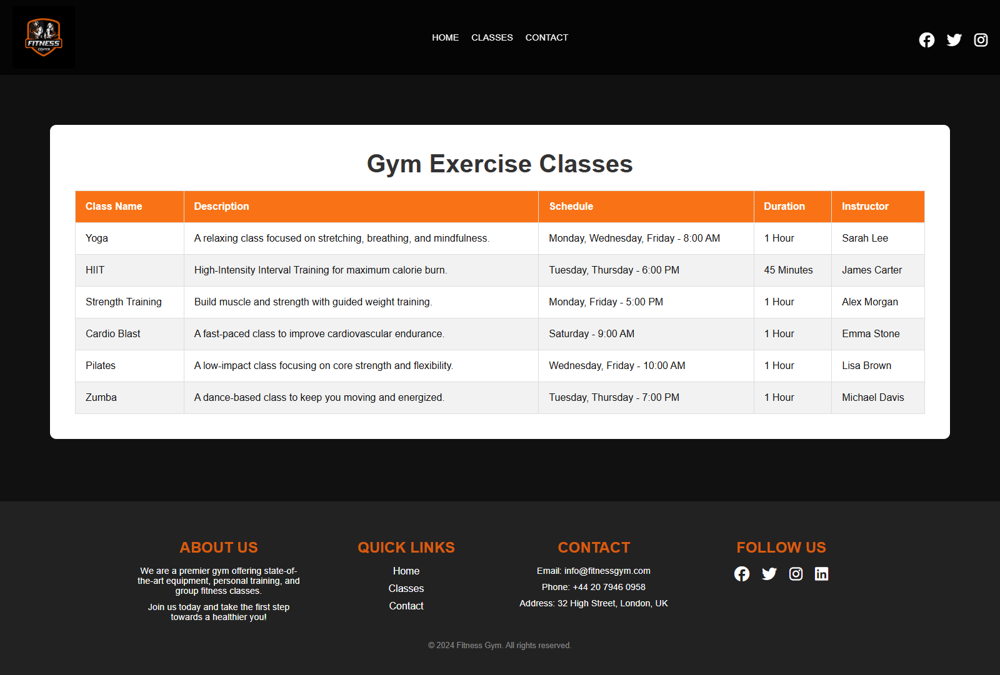
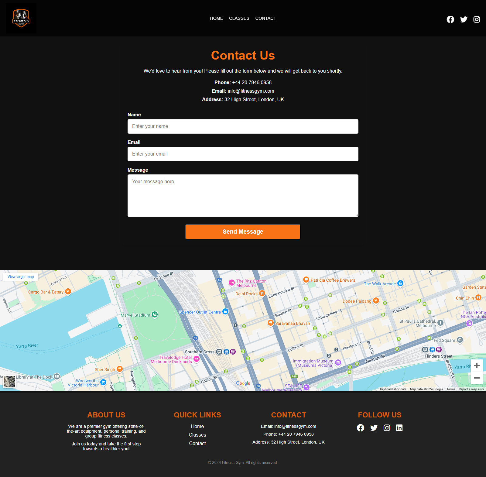

# Fitness Gym Web Application

## Overview

Welcome to the Fitness Gym Web Application! This project serves as a comprehensive platform for fitness enthusiasts to explore available gym classes, learn about membership plans, and connect with the gym staff. Designed with a user-first approach, the application provides an engaging and intuitive experience for visitors to stay informed and take the first steps towards a healthier lifestyle.

## Purpose

The primary objective of this project is to:
- Simplify the process of discovering fitness classes and their schedules.
- Offer clear membership plans to cater to different fitness goals.
- Provide users with an easy way to contact the gym and get their questions answered.

By addressing these needs, the web application ensures that users can efficiently interact with the gym, discover classes, and make informed decisions about their fitness journey.

## Key Features

### 1. Home Page:
   - Highlights the gym's vision and facilities.
   - Features a dynamic banner showcasing key offerings.

### 2. Classes Page:
   - Displays a detailed table of available fitness classes, including their description, schedule, duration, and instructors.

### 3. Contact Page:
   - Allows users to send inquiries through a form.
   - Provides essential contact details and a Google Maps integration for location.

### 4. Responsive Design:
   - Fully optimized for various devices including desktops, tablets, and mobile phones.

## Deployment Procedure

To deploy this web application, follow these steps:

### 1. Clone the Repository:
   ```bash
   git clone <repository-url>
   ```

### 2. Navigate to the Project Directory:
   ```bash
   cd fitness-gym-web-app
   ```

### 3. Host the Application:
   - Use a local server (e.g., VS Code Live Server, XAMPP) to serve the HTML files.
   - Alternatively, upload the project files to a web hosting platform like Netlify, Vercel, or GitHub Pages.

## Screenshots

### Home Page


### Classes Page


### Contact Page


## Code Attribution

### 1. External libraries and tools:
   - Font Awesome: Used for social media icons. [Font Awesome](https://fontawesome.com/)

### 2. Code comments in relevant sections:
   ```html
   <!-- Font Awesome CDN for social icons -->
   <link
     rel="stylesheet"
     href="https://cdnjs.cloudflare.com/ajax/libs/font-awesome/6.7.1/css/all.min.css"
     integrity="sha512-5Hs3dF2AEPkpNAR7UiOHba+lRSJNeM2ECkwxUIxC1Q/FLycGTbNapWXB4tP889k5T5Ju8fs4b1P5z/iB4nMfSQ=="
     crossorigin="anonymous"
     referrerpolicy="no-referrer"
   />
   ```

## Target Audience

This web application is targeted at:
- Individuals seeking structured fitness programs.
- Current gym members looking to explore additional classes.
- Prospective members interested in membership options.

## User Stories

1. "As a user, I want to view available classes so I can decide which ones fit my schedule."
2. "As a prospective member, I want to view membership plans so I can choose one that meets my fitness goals."
3. "As a visitor, I want to contact the gym easily to resolve my inquiries."

## Development Rationale

This project was developed to create an easy-to-navigate, visually appealing platform that bridges the gap between fitness service providers and their clients. By integrating modern web design principles, the application ensures seamless navigation, intuitive UI, and responsive layouts.

## Testing and Known Issues

### Testing Process

- **Manual Testing:**
  - Verified responsiveness on devices with various screen sizes.
  - Tested all navigation links for functionality.
  - Checked form validation and submission.

- **Browser Compatibility:**
  - Tested on Chrome

### Bugs Fixed

1. **Mobile Navigation Issue:** Resolved an issue where the mobile menu did not collapse after selecting a link.
2. **Class Schedule Alignment:** Fixed alignment issues in the "Classes" table for smaller screens.

### Known Bugs

- **Google Maps Loading Issue:** The embedded Google Maps iframe may not load on some networks due to restrictions.

## Development Life Cycle

### 1. Planning:
   - Defined project objectives and user stories.
   - Created wireframes and a sitemap.

### 2. Development:
   - Built HTML structure for pages.
   - Styled the application using CSS with a focus on responsiveness.

### 3. Testing:
   - Conducted functional and responsive testing.

### 4. Deployment:
   - Deployed to a live server for user access.

### 5. Maintenance:
   - Regularly updating content and addressing feedback.

## Contact

For questions or suggestions, please contact us:
- **Email:** info@gym.com
- **Phone:** +44 20 7946 0958

## Credits

- Developer: [Lloyd]

- Icons: [FontAwesome](https://fontawesome.com/)

- Map Integration: [Google Maps Embed API](https://developers.google.com/maps/documentation/embed/get-started)


